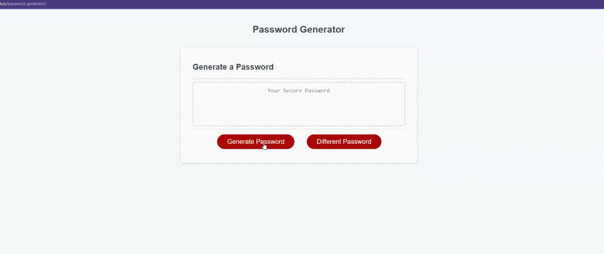

# Password Generator
This is a password generator challenge assignment.

## User Story
User wants to randomly generate a password that meets certain criteria. 

## Languages
- JavaScript
- HTML 
- CSS

## Acceptance Criteria
- When the user clicks the password generate button, pesented with a series of prompts for password criteria. 
- When prompt with the length of password, the user should be able to only choose a length between 8 and 128 characters. 
- When prompt with the character to include, the user should be able to choose uppercase, lowercase, special or numerical characters. 
- User must choose atleast one type of character. 
- When all the promts are answered, the password is generated that matches the criteria. 
- When the password is generated, the password must be displayed or written to the page. 

## Final Product Link
[**Click Here**](https://pravton.github.io/password-generator/) to view the project in Github Pages.

## Mockup

## Final Output
>### NOTE
>The application have an additional different password button which will be easier for the user to generate a different password with same criteria provided, so they can avoid aswering the prompt if they don't like the password generated.

